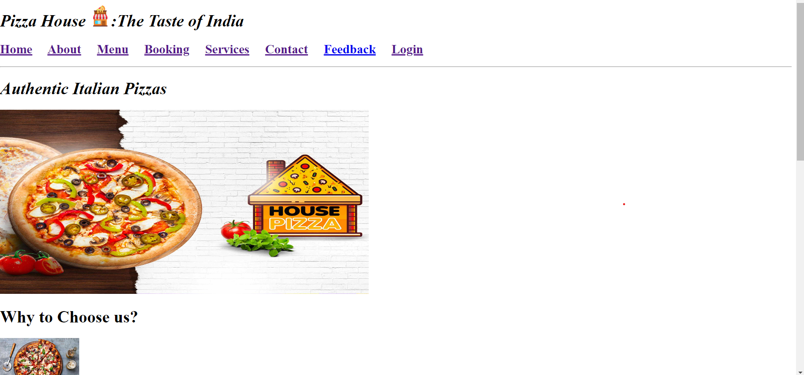
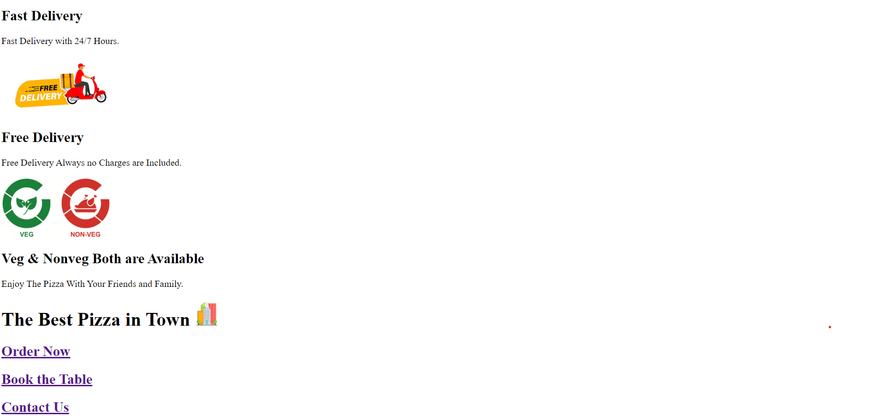
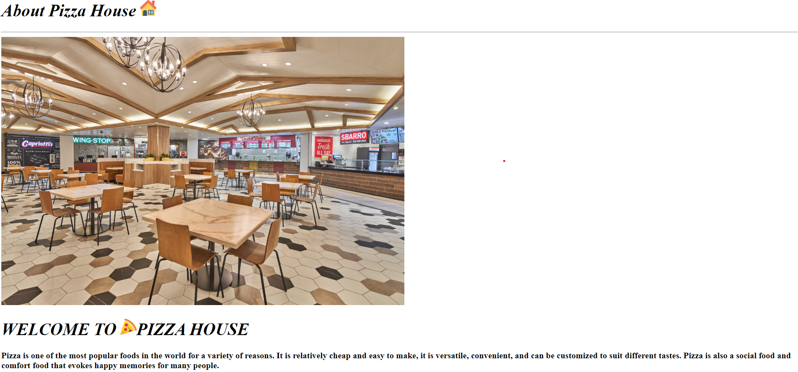
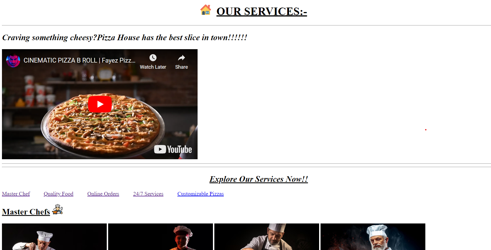

# PIZZA HOUSE PROJECT
## This is our HTML project created by Group 1.In this project we created the the PIZZA HOUSE webpage.
--------
# PROJECT OVERVIEW 

Ordered lists

1. HOME PAGE
2. ABOUT PAGE
3. MENU PAGE
4. BOOKING PAGE
5. SERVICES PAGE
6. CONTACT PAGE
7. FEEDBACK PAGE

# HOME PAGE SCREENSHOT

--

When creating a webpage for a pizza house, it's essential to include key information that not only attracts customers but also provides them with all the necessary details to make their dining experience enjoyable.
# ABOUT PAGE

An "About" page on a pizza house website typically provides detailed information about the restaurant, its history, values, and unique features. This page helps build a connection with potential customers by sharing the story behind the business and what makes it special.
# SERVICES PAGE

Creating a "Services" page for a pizza house involves detailing the different services the restaurant offers to its customers. This page should clearly communicate the variety of services available, such as dine-in, delivery, catering, and any special offerings. 

[Visit GitHUb Repo](https://github.com/Payal267/icp9.0-html-github-group1-project-1.git)

[Visit Project Website](https://icp9-0-html-github-group1-project.vercel.app/)

THANKYOU..😇
